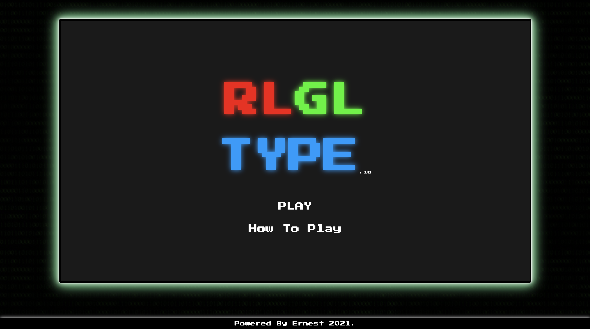
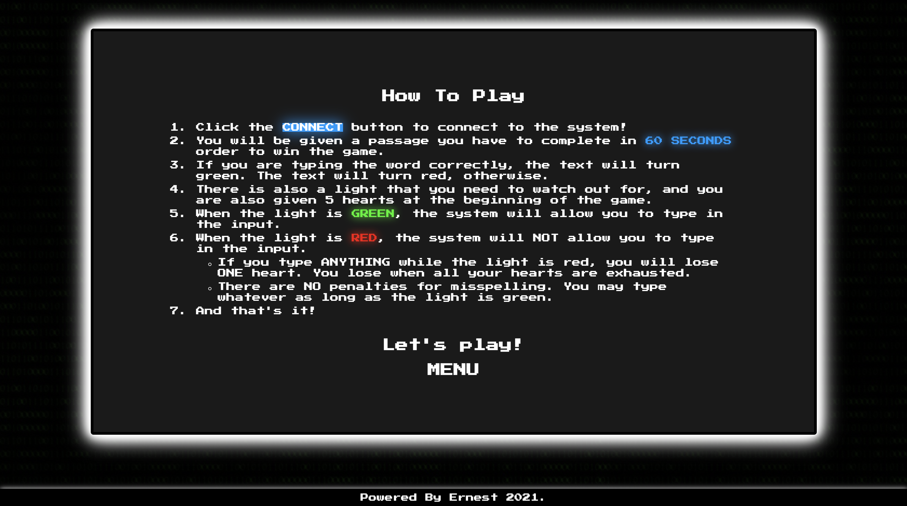
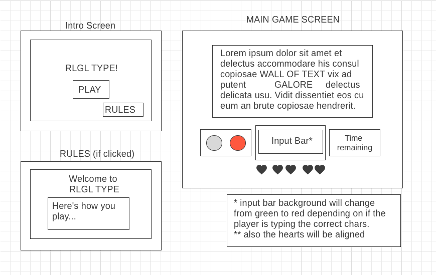

# RLGLType.io
-----------
## Overview
-----------
The project is a browser-based typing game that is similar to the TypeRacer game, but with the Red Light Green Light functionality and health point system. The user is given a passage and the user will have to type every character in every word correctly within 60 seconds in order to win the game.

While the game is running, there is a light that will switch between Green, Yellow and Red. The player is not allowed to type anything when the light is red and they will be enabled to once the light is green. If the player types while the light is red, they lose one health point. 

The game ends when one of the following scenarios are met: 
- User's HP reaches 0.
- Time runs out.
- User finishes the passage within 60 seconds.

When a game is finished, the game will display the player’s words per minute for that particular game / scenario, if the player won the game or not, and an option to play the game.

---
## Screenshots
---
|Homepage  |  Rules   |
|:------------------------:|:-------------:|
  |  

|  Game  |  Game End   
:-----------:|:----------:|
  |  

------
## Wireframe
------

### What's Next?
- Have an upload button that allows the user to enter their own passage that they want to type out.
- Increase passages to choose from.
- Make the transition between the homepage and game page smoother.
- Think of a better way to present score in the end. 
- Code refactor.
- Fix bugs. See below.

### Known Bugs?
- Timer does not reset when the game "powers down" after a game finishes.

---
All rights reserved. Ernest Bruno 2021.